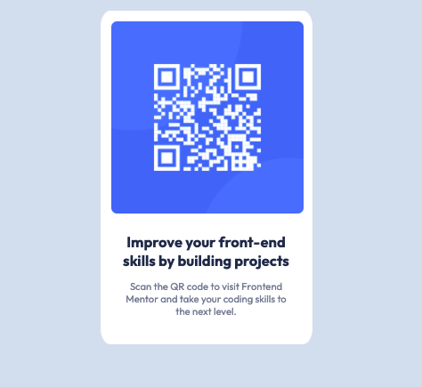

# Frontend Mentor - QR code component solution

This is a solution to the [QR code component challenge on Frontend Mentor](https://www.frontendmentor.io/challenges/qr-code-component-iux_sIO_H). Frontend Mentor challenges help you improve your coding skills by building realistic projects. 

## Table of contents

- [Overview](#overview)
  - [Screenshot](#screenshot)
  - [Links](#links)
- [My process](#my-process)
  - [Built with](#built-with)
  - [What I learned](#what-i-learned)
  - [Continued development](#continued-development)
- [Author](#author)

## Overview

### Screenshot

### Links

- [Solution URL](https://github.com/iamindika/qr-code-component-main/tree/main/src)
- [Live Site URL](https://vigilant-shockley-a51f78.netlify.app/)

## My process

### Built with

- Semantic HTML5 markup
- CSS with BEM naming conventions
- Mobile-first workflow
- [React](https://reactjs.org/) - JS library

### What I learned

This project helped me practice basic React component composition, semantic html markup and styling with css. My project utilizes a concise html markup and streamline css to provide the most efficient solution.  My css styles have been organized by typography, reusuable classes, and specific id's/classes for easy future modification.  

### Continued development

In future projects I want to utilize stateful React components, improve my understanding of semantic html markup and css properties, and learn about module bundlers like webpack.  

## Author

- Frontend Mentor - [@iamindika](https://www.frontendmentor.io/profile/iamindika)
- Twitter - [@1am1nd1ka](https://www.twitter.com/1am1nd1ka)